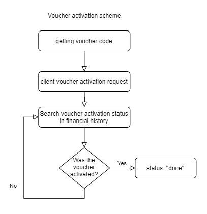

# uusd-go-vouchers
UUSD Donation Library used to work with vouchers written in Go

[](https://goreportcard.com/report/github.com/utopia-opensource/uusd-go-vouchers)

## Installation

```bash
go get github.com/utopia-opensource/uusd-go-vouchers
```

then

```go
import uusdv "github.com/utopia-opensource/uusd-go-vouchers"
```

Usage
-------

```go
h := uusdv.Handler{Client: utopiaClient}
```

or

```go
h := uusdv.Handler{}
h.SetClient(utopiaClient)
```

Then try activating the voucher:

```go
data := h.ActivateVoucher("UTP-P3FH-OJQZ-7XWI-CAVT-LYDW")
fmt.Println(data)
```

response example:

```json
{
	"status": "pending",
	"referenceNumber": "367404A95932624C284B16AF1C1EDF1BB0F9CDCA1CC5136B167378BBF933FAD8",
	"amount": 0
}
```

check voucher status by reference number:

```go
referenceNumber := "367404A95932624C284B16AF1C1EDF1BB0F9CDCA1CC5136B167378BBF933FAD8"
voucherStatusData := handler.CheckVoucherStatus(referenceNumber)
fmt.Println(voucherStatusData)
```

response example:

```json
{
	"status": "done",
	"created": "2020-01-14T13:18:21.232",
	"amount": 2,
	"comments": "",
	"direction": 1,
	"trid": "0ZWTT62Z4DO51"
}
```



# How can this be used?
* creating a web service that processes client requests;
* creation of a payment service;
* development of a bot for the channel.

License
-------

crypton-go-vouchers is licensed under [The MIT License](LICENSE).
